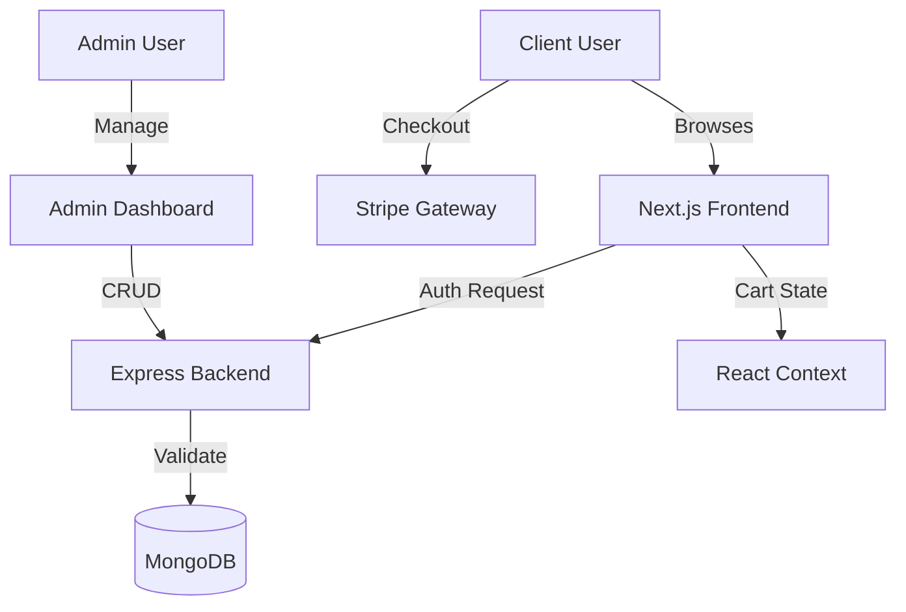

<div align="center">

# 👻 GhostShop
### Premium Tech E-Commerce Experience

[](https://nextjs.org/)
[](https://reactjs.org/)
[](https://tailwindcss.com/)
[](https://nodejs.org/)
[](https://expressjs.com/)
[](https://www.mongodb.com/)
[](https://stripe.com/)

<br />

<p align="center">
  
  <br/>
  <b>Build. Deploy. Scale.</b>
</p>

</div>

---

## 🚀 Overview

**GhostShop** is a modern, full-stack e-commerce application designed for performance and scalability. Built with the cutting-edge **MERN stack** (MongoDB, Express, React 19, Node.js) and powered by **Next.js 16**, it offers a seamless shopping experience with server-side rendering, robust state management, and secure payment processing.

From a responsive, dark-mode-enabled frontend to a powerful admin dashboard, every component is crafted for production readiness.

## ✨ Key Features

### 🛒 Frontend Architecture
*   **Next.js 16 (App Router)**: Utilizing Server Components for lightning-fast initial page loads and SEO.
*   **Dynamic UI/UX**: Implemented with **Tailwind CSS 4** for responsive, mobile-first design.
    *   Dark/Light Mode toggle.
    *   Smooth transitions and micro-interactions.
    *   Pulse animations for loading states.
*   **State Management**: Complex cart logic and user authentication state handled via React Context API.
*   **Payment Integration**: Secure, PCI-compliant checkout flows using **Stripe**.

### 🛠️ Backend Systems
*   **Express 5 API**: High-performance RESTful API structure.
*   **Secure Authentication**: JWT-based stateless authentication with strict password hashing (bcryptjs).
*   **Database**: **MongoDB** with Mongoose 9 for strict schema validation and scalable data storage.
*   **Admin Middleware**: Role-based access control protecting sensitive management routes.
*   **Security First**: Implemented Helmet for header security and Morgan for detailed logging.

### ⚙️ Admin Dashboard
*   **Product Management**: Full CRUD capabilities for store inventory.
*   **User Oversight**: capabilities to manage registered users.
*   **Robust image handling**: Defers to `SafeImage` components to gracefully handle missing or malformed data.

---

## 🔄 System Flow



---

## 🛠️ Installation & Setup

Follow these steps to get the project running locally.

### Prerequisites
*   Node.js (v18+ recommended)
*   MongoDB Instance (Local or Atlas)
*   Stripe Account (for API keys)

### 1. Clone the Repository
```bash
git clone https://github.com/your-username/simple-ecommerce-website.git
cd simple-ecommerce-website
```

### 2. Backend Setup
Navigate to the backend directory and install dependencies.
```bash
cd backend
npm install
```

Create a `.env` file in the `backend` root:
```env
PORT=8000
MONGO_URI=your_mongodb_connection_string
JWT_SECRET=your_secure_jwt_secret
STRIPE_SECRET_KEY=your_stripe_secret_key
```

Start the backend server:
```bash
npm run dev
```

### 3. Frontend Setup
Open a new terminal and navigate to the frontend directory.
```bash
cd frontend
npm install
```

Create a `.env` file in the `frontend` root:
```env
NEXT_PUBLIC_STRIPE_PUBLISHABLE_KEY=your_stripe_publishable_key
NEXT_PUBLIC_API_URL=http://localhost:8000/api
```

Start the frontend development server:
```bash
npm run dev
```

The application should now be live at `http://localhost:3000`! 🚀

---

## 📚 API Documentation

### Products
| Method | Endpoint | Description | Access |
| :--- | :--- | :--- | :--- |
| `GET` | `/api/products` | Fetch all products | Public |
| `GET` | `/api/products/:id` | Fetch single product | Public |
| `POST` | `/api/products` | Create new product | **Admin** |
| `PUT` | `/api/products/:id` | Update product | **Admin** |
| `DELETE` | `/api/products/:id` | Delete product | **Admin** |

### Users & Auth
| Method | Endpoint | Description | Access |
| :--- | :--- | :--- | :--- |
| `POST` | `/api/users/login` | Authenticate user | Public |
| `POST` | `/api/users/register` | Register new user | Public |
| `GET` | `/api/users` | List all users | **Admin** |
| `DELETE` | `/api/users/:id` | Delete user | **Admin** |

---

## 🤝 Contributing
Contributions are welcome! Please fork the repository and submit a pull request for any enhancements.

1.  Fork the Project
2.  Create your Feature Branch (`git checkout -b feature/AmazingFeature`)
3.  Commit your Changes (`git commit -m 'Add some AmazingFeature'`)
4.  Push to the Branch (`git push origin feature/AmazingFeature`)
5.  Open a Pull Request

---

## 📝 License

Distributed under the MIT License. See `LICENSE` for more information.

<div align="center">
  <br />
  <p>Made with ❤️ by <b>Jonni & the Team</b></p>
</div>
