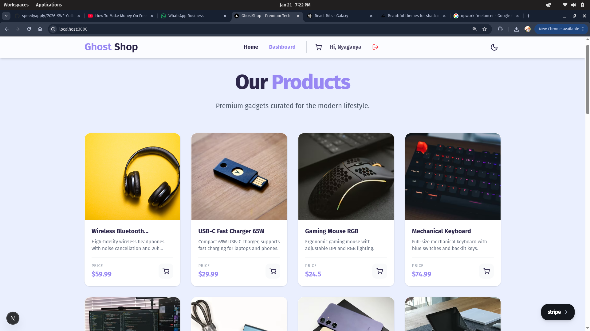
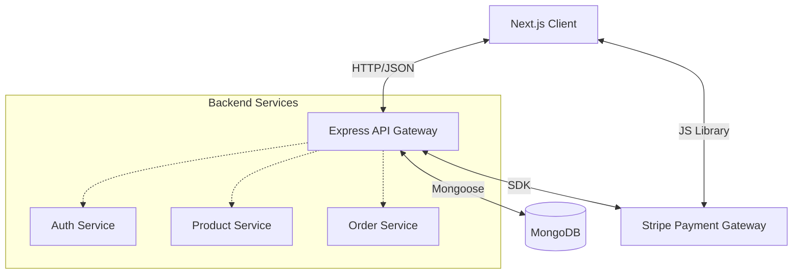
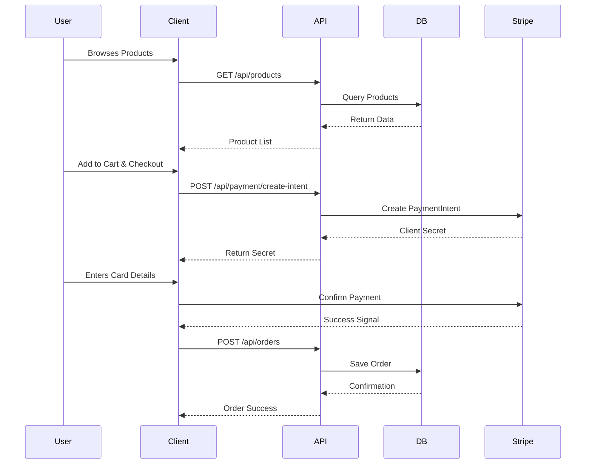

# GhostShop - Premium E-Commerce Platform



## Overview

GhostShop is a modern, full-stack e-commerce solution built to deliver a seamless shopping experience. It combines a high-performance Next.js frontend with a robust Node.js/Express backend, featuring secure payments via Stripe, comprehensive admin management, and a polished, responsive user interface. This project demonstrates a production-ready architecture suited for scalable digital commerce.

## Table of Contents

- [Key Features](#key-features)
- [Technology Stack](#technology-stack)
- [System Architecture](#system-architecture)
- [Application Flow](#application-flow)
- [Project Structure](#project-structure)
- [API Documentation](#api-documentation)
- [Frontend Routes](#frontend-routes)
- [Installation & Setup](#installation--setup)

## Key Features

- **Modern User Interface**: Built with Next.js 16 and Tailwind CSS 4 for a responsive, dark-mode enabled design.
- **Secure Authentication**: JWT-based authentication for users and administrators.
- **Product Management**: Full CRUD capabilities for products with image support.
- **Shopping Cart**: Real-time state management for a seamless cart experience.
- **Payment Integration**: Secure checkout process integrated with Stripe Payment Intents.
- **Admin Dashboard**: Analytical dashboard for managing products, orders, and users.
- **Order Tracking**: Comprehensive order history and status tracking.
- **Performance**: Optimized with server-side rendering and static generation where applicable.

## Technology Stack

### Frontend


### Backend


## System Architecture

The application follows a decoupled client-server architecture. The frontend consumes a RESTful API provided by the backend, which communicates with a MongoDB cluster.


```mermaid
graph TD
    Client[Next.js Client] <-->|HTTP/JSON| API[Express API Gateway]
    API <-->|Mongoose| DB[(MongoDB)]
    API <-->|SDK| Stripe[Stripe Payment Gateway]
    Client <-->|JS Library| Stripe

    subgraph "Backend Services"
        API
        Auth[Auth Service]
        Product[Product Service]
        Order[Order Service]
    end

    API -.-> Auth
    API -.-> Product
    API -.-> Order
```

## Application Flow

The following diagram illustrates the typical user journey from browsing to checkout.


```mermaid
sequenceDiagram
    participant User
    participant Client
    participant API
    participant DB
    participant Stripe

    User->>Client: Browses Products
    Client->>API: GET /api/products
    API->>DB: Query Products
    DB-->>API: Return Data
    API-->>Client: Product List

    User->>Client: Add to Cart & Checkout
    Client->>API: POST /api/payment/create-intent
    API->>Stripe: Create PaymentIntent
    Stripe-->>API: Client Secret
    API-->>Client: Return Secret

    User->>Client: Enters Card Details
    Client->>Stripe: Confirm Payment
    Stripe-->>Client: Success Signal

    Client->>API: POST /api/orders
    API->>DB: Save Order
    DB-->>API: Confirmation
    API-->>Client: Order Success
```

## Project Structure

### Backend (`/backend`)

```
backend/
├── auth/           # Authentication utilities
├── configs/        # Database and system configurations
├── controllers/    # Request logic (Products, Orders, Auth)
├── middlewares/    # Custom middlewares (Auth, Error handling)
├── models/         # Mongoose Schemas
├── routes/         # API Route definitions
├── app.js          # Express app setup
└── server.js       # Entry point
```

### Frontend (`/frontend`)

```
frontend/
├── app/            # Next.js App Router pages
│   ├── admin/      # Dashboard routes
│   ├── cart/       # Shopping cart page
│   ├── checkout/   # Payment page
│   └── product/    # Product details
├── components/     # Reusable UI components
├── context/        # React Context (Auth, Cart)
└── lib/            # Utility functions
```

## API Documentation

### Authentication

- `POST /api/auth/register` - Register a new user
- `POST /api/auth/login` - Authenticate user and return token

### Products

- `GET /api/products` - List all products
- `GET /api/products/:id` - Get single product details
- `POST /api/products` - Create product (Admin only)
- `PUT /api/products/:id` - Update product (Admin only)
- `DELETE /api/products/:id` - Delete product (Admin only)

### Orders

- `POST /api/orders` - Create a new order
- `GET /api/orders` - List user orders
- `GET /api/orders/all` - List all orders (Admin only)

## Frontend Routes

- `/` - Landing Page
- `/product/[id]` - Product Details
- `/cart` - Shopping Cart
- `/checkout` - Secure Checkout
- `/login` / `/register` - User Authentication
- `/admin` - Admin Dashboard
- `/admin/products` - Product Management
- `/admin/orders` - Order Management
- `/admin/users` - User Management

## Installation & Setup

### Prerequisites

- Node.js (v18+)
- MongoDB Instance (Local or Atlas)
- Stripe Account (for payment testing)

### 1. Clone the Repository

```bash
git clone https://github.com/JonniTech/Simple-eCommerce-Website.git
cd Simple-eCommerce-Website
```

### 2. Backend Setup

Navigate to the backend directory and install dependencies.

```bash
cd backend
npm install
```

Create a `.env` file in the `backend` directory:

```env
PORT=5000
MONGO_URI=your_mongodb_connection_string
JWT_SECRET=your_jwt_secret
STRIPE_SECRET_KEY=your_stripe_secret_key
FRONTEND_URL=http://localhost:3000
```

Start the server:

```bash
npm run dev
```

### 3. Frontend Setup

Navigate to the frontend directory and install dependencies.

```bash
cd ../frontend
npm install
```

Create a `.env.local` file in the `frontend` directory:

```env
NEXT_PUBLIC_API_URL=http://localhost:5000/api
NEXT_PUBLIC_STRIPE_PUBLISHABLE_KEY=your_stripe_publishable_key
```

Start the application:

```bash
npm run dev
```

Access the application at `http://localhost:3000`.

---

© GhostShop Project. All Rights Reserved.
